# M07-UF3
# Documentació ACTIVITAT 13 Django

## 0.Captures de les pagines centre/alumne,centre,centre/professors,centre/alumne_form i centre/professor_form
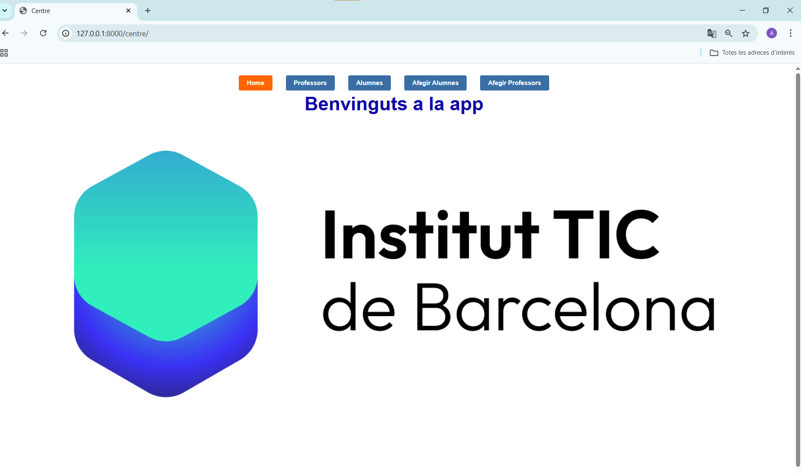
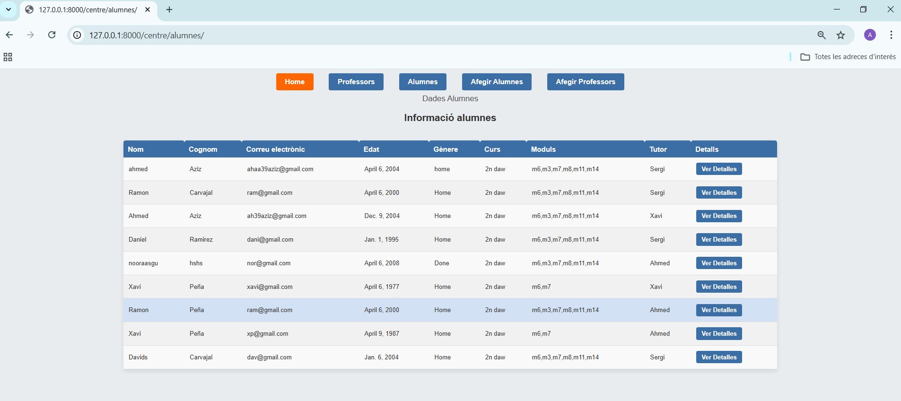
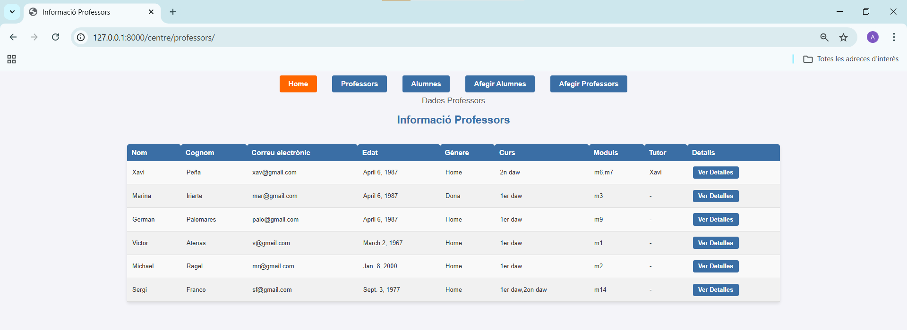
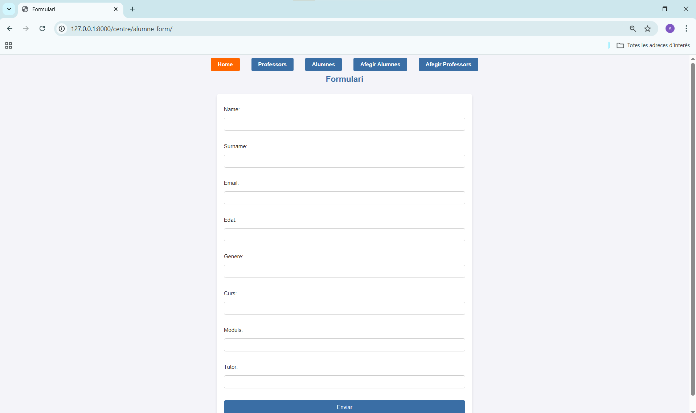
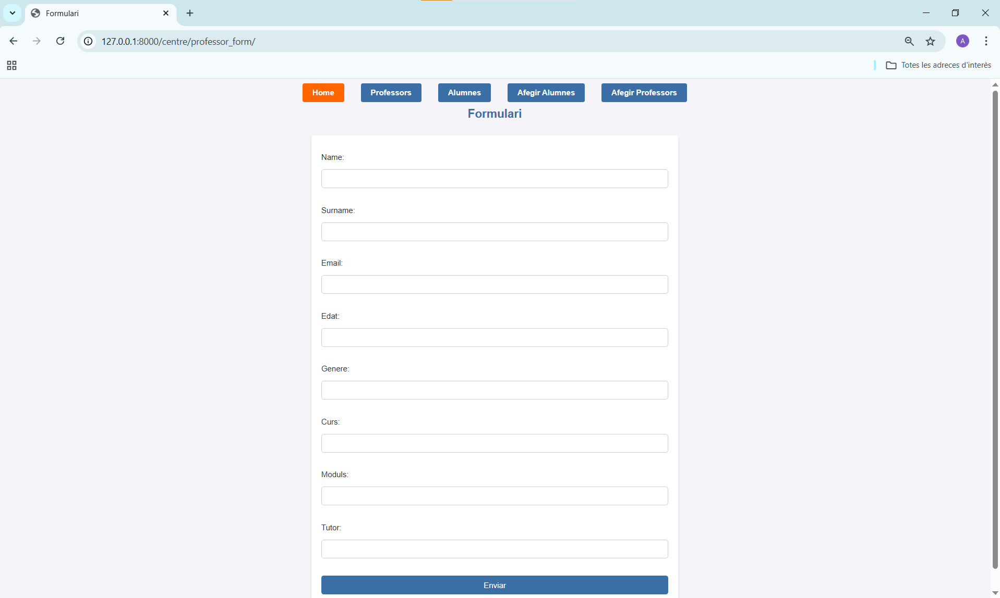

## 1. Pagina de detalls de la pagina alumnes

### Captura de details 
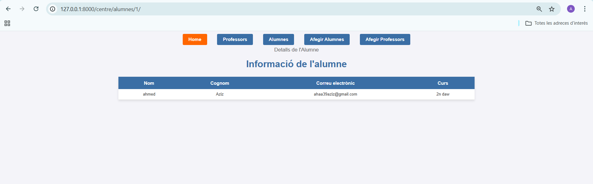

## 2.Comandes Per fer la migracio a la BBDD

### Captura de les comandes
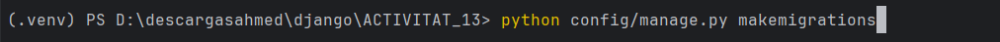
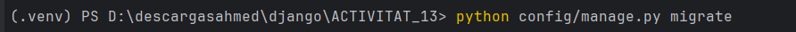

---

## 3. Captures de la part del admin de Django

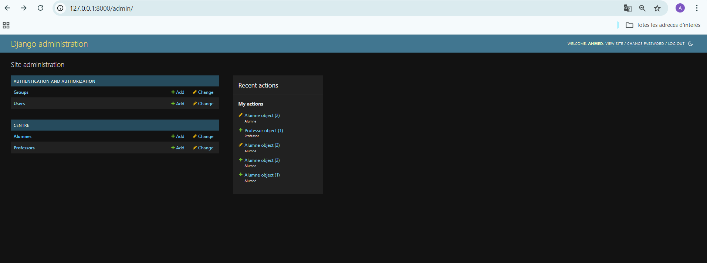
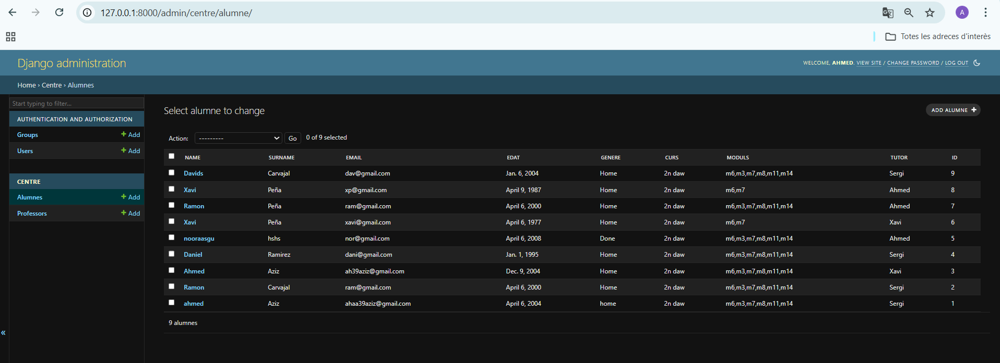
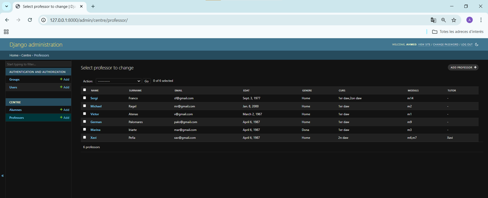
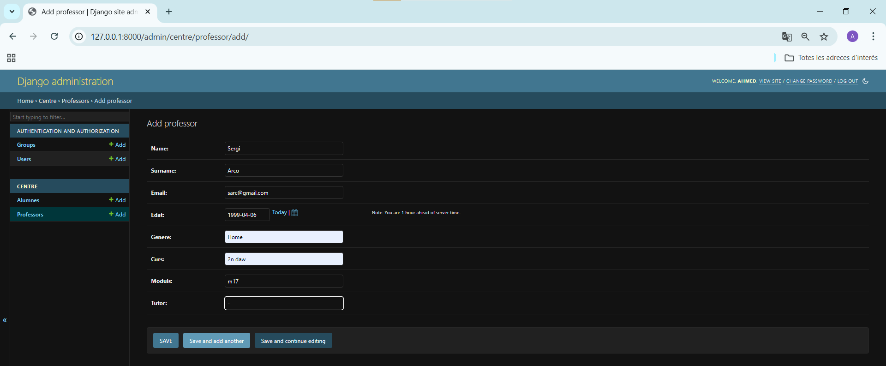

## 4.Captures del pgAdmin
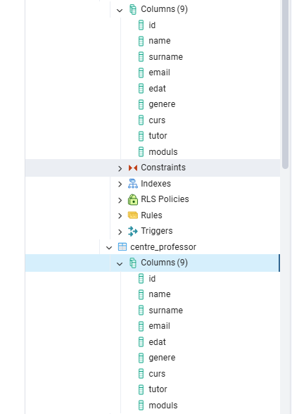
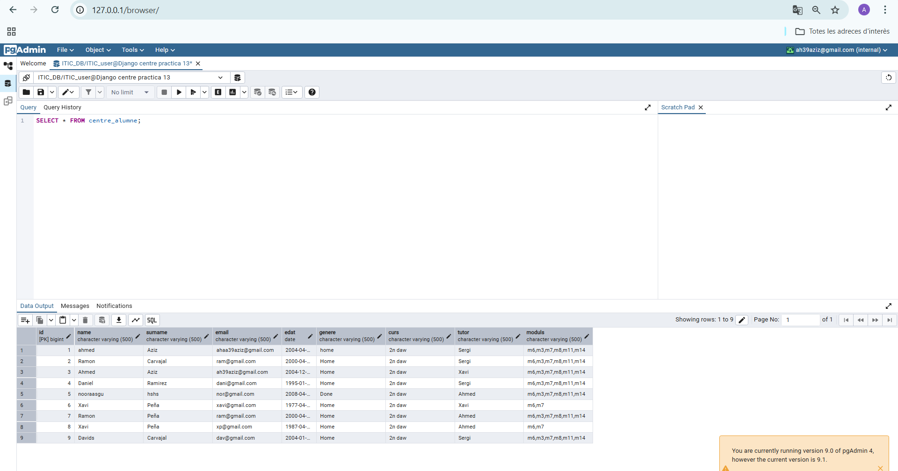
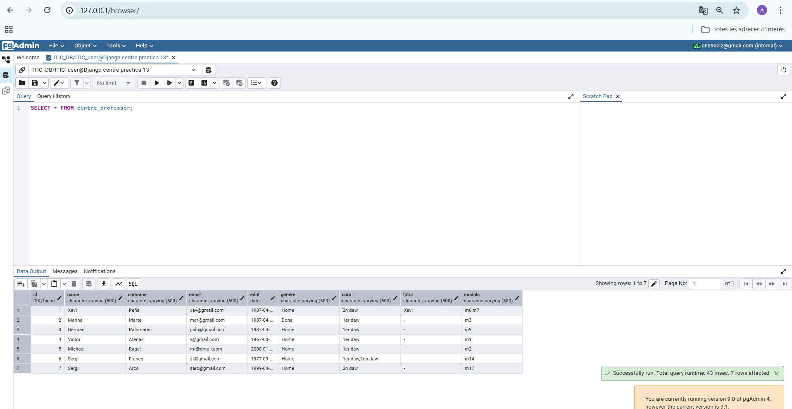
